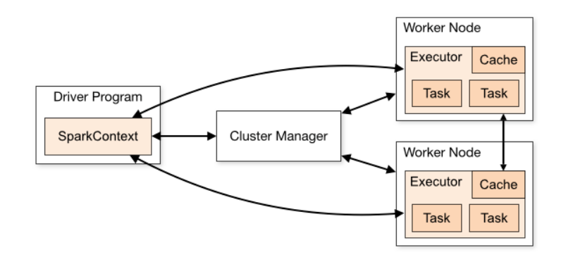

## Working with Pyspark
Apache Spark is an open source framework that allows to perform large scale real-time data processing at good speed. PySpark is an Python API of Apache Spark  which acts as an interface to work on Spark using Python.It was mostly written in Scala programming language. It runs upto 100x faster than the Hadoop-Mapreduce with advent of "In-memory processing" and supports real-time computation.It provides robust, fault tolerant data objects named as RDD's that are useful to work on Machine learning and big data based applications.

#### Spark Architecture
The major features of spark that support high speed real-time data processing are the
parallel processing of distributed data, in-memory computation abiltity and lazy evaluations(when a set of 
transformations are applied on data, instead of execution- a Directed Acyclic graph[DAG] is generated
in spark and execution is done only when any action is triggered.).
The Spark Architecture follows a Master-Slave architecture where each cluster has
 a Master Node(Driver), multiple Slave nodes(Workers) and a cluster manager.
 
 
 
- The Master node has a driver program which schedules the jobs, negotiates with
 cluster manager for allocation of resources.
- After the Spark initalization a Spark context is created by the driver prgram that handles all 
spark functionalities.
- The driver program splits the input data into partitions and distributes it across worker nodes to
process on it.
- A job is split into multiple taks by the SparkContext and tasks are executed by the executors in worker nodes.
##### Internal flow
The Sparkcontext implicitly converts the user written code with transformations and actions to DAG . The DAG is is further converted as a exection plan by the driver program and assigns tasks to specific worker nodes.The driver program negotiates with cluster manager for allocation of resources at worker nodes inorder to perform the tasks assigned.The cluster manager launches the executors on worker nodes which are registered at the driver program and then perform the computation.The results and status from executors is sent back to the driver program.

---

SparkContext is compatible with various types of cluster manager that include -Standalone Cluster Manager, YARN(Yet Another Resource Navigator), Mesos.
#### PySpark Using Colab
To work with PySpark on local machine needs Java, Scala, Py4j library etc and several other software to be installed so instead PySpark on Google Colab is better alternative when the data used is mounted on drive.
#### RDD - Resilient Distributed Datasets
RDD is the basic data structure in Spark which is immutable and fault-tolerant in nature. It is immutable data structure and it is logically partitioned across multiple nodes in the cluster to support parallel processing. Since it is immutable for each transformation operation that update any values or schema details create a new RDD instead of applying changes. These transformations are only processed when an action operation that returns result is invoked.

- Transformation operation : map(), filter(), orderBy(), groupBy() etc
These operations when used alone do not produce any result to be returned.
- Action operation : reduce(), collect(), count(), show()
These invoked processing and return a result after execution.

